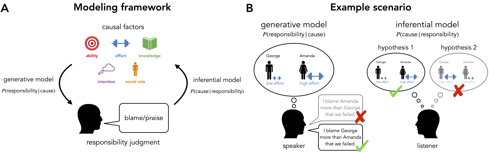

# Inference from social evaluation

This repository contains the experiments, data, analyses, and figures for the paper ["Inference from social evaluation"](https://osf.io/preprints/psyarxiv/h9c5w?view_only=) by Zachary J. Davis, Kelsey R. Allen, Max Kleiman-Weiner, Julian Jara-Ettinger, and Tobias Gerstenberg (2025, _Journal of Personality and Social Psychology_).

__Contents__:

- [Introduction](#introduction)
- [Preregistrations](#preregistrations)
- [Repository structure](#repository-structure)
- [CRediT author statement](#credit-author-statement)

## Introduction

People have a remarkable ability to infer the hidden causes of things. From physical evidence, such as muddy foot prints on the floor, we can figure out what happened and who did it. Here, we investigate another source of evidence: social evaluations. Social evaluations, such as praise or blame, are commonplace in everyday conversations. While such evaluations don't fully reveal what happened, they provide valuable clues. Across three experiments, we present situations where a person was praised or blamed, and participants' task is to use that information to figure out what happened. In Experiment 1, we find that people draw systematic inferences from social evaluations about situational factors, a person's actions, capabilities, and social roles. In Experiments 2 and 3 we develop computational models that generate praise and blame judgments by considering what causal role a person's action played, and what action they should have taken. Inverting these generative models of praise and blame via Bayesian inference yields accurate predictions about what inferences participants draw based on social evaluations.



## Preregistrations

You can find pre-registrations for many of the experiments via the links below: 

- [Experiment 1](https://osf.io/yrjd6)
- [Experiment 2a](https://osf.io/s9dqw)
- [Experiment 2b](https://osf.io/yz2nk)
- [Experiment 3c](https://osf.io/x37rj)

## Repository structure

```
.
├── code
│   ├── R
│   ├── experiments
│   └── python
├── data
│   ├── experiment1
│   ├── experiment2a
│   ├── experiment2b
│   ├── experiment3a
│   ├── experiment3b
│   └── experiment3c
├── docs
│   ├── R
│   ├── experiment1
│   ├── experiment2a
│   └── experiment2b
└── figures
    ├── diagrams
    ├── paper
    └── stimuli
```

### code

#### R

- Statistical analysis and visualizations. 
- You can access a rendered analysis file [here](https://cicl-stanford.github.io/inference_from_social_evaluation/R/). 

#### experiments

- Experiment code. 
- You can try out demos of [Experiment 1](https://cicl-stanford.github.io/inference_from_social_evaluation/experiment1/), [Experiment 2a](https://cicl-stanford.github.io/inference_from_social_evaluation/experiment2a/), and [Experiment 2b](https://cicl-stanford.github.io/inference_from_social_evaluation/experiment2b/) 

#### python

- Contains the code for modeling action predictions, blame judgments, and inferences in Experiment 3. 

### data

- Raw data files and model prediction files. 

### figures

- Paper figures and images of the stimuli. 

## CRediT author statement

Please see [here](https://www.elsevier.com/researcher/author/policies-and-guidelines/credit-author-statement) for definitions of the different terms.

| Term                       | Zach | Kelsey | Max | Julian | Tobias |
|----------------------------|------|--------|-----|--------|--------|
| Conceptualization          |      | X      | X   | X      | X      |
| Methodology                | X    | X      | X   |        | X      |
| Software                   | X    | X      |     | X      | X      |
| Validation                 |      |        |     |        | X      |
| Formal analysis            | X    | X      |     |        | X      |
| Investigation              | X    |        |     |        |        |
| Resources                  |      |        |     |        |        |
| Data Curation              | X    |        |     |        | X      |
| Writing - Original Draft   |      |        |     |        | X      |
| Writing - Review & Editing | X    | X      | X   | X      | X      |
| Visualization              | X    |        |     |        | X      |
| Supervision                |      |        |     |        | X      |
| Project administration     |      |        |     |        | X      |
| Funding acquisition        |      |        |     |        | X      |


