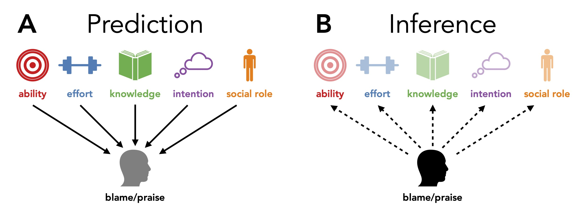

# Inference from social evaluation

Humans have a remarkable ability to infer the hidden causes of things. From physical evidence, such as cookie crumbles on the kitchen floor, we can figure out what happened and who did it. Here, we investigate a different source of evidence about what happened: people's social evaluations. Across three experiments, we present situations where a person was praised or blamed, and participants' task is to figure out what happened based on this social evaluation. In Experiment 1, we find that people draw systematic inferences from social evaluations about situational factors, a person's actions, their capabilities, and social roles. In Experiments 2 and 3 we develop computational models that predict praise and blame judgments by considering what causal role a person's action played, and what action they should have taken. By inverting these generative models of praise and blame via Bayesian inference, we derive accurate predictions about what inferences participants draw based on social evaluations.



## Repository structure

```
.
├── code
│   ├── R
│   ├── experiments
│   └── python
├── data
│   ├── experiment1
│   ├── experiment2a
│   ├── experiment2b
│   ├── experiment3a
│   ├── experiment3b
│   └── experiment3c
├── docs
│   ├── R
│   ├── experiment1
│   ├── experiment2a
│   └── experiment2b
└── figures
    ├── experiment1
    ├── experiment2a
    ├── experiment2b
    ├── experiment3a
    ├── experiment3b
    └── experiment3c
```

### code

#### R

- Statistical analysis and visualizations. 
- You can access a rendered analysis file [here](https://cicl-stanford.github.io/inference_from_social_evaluation/R/). 

### data

- Raw data files and model prediction files. 

### figures

- Experiment stimuli and plots. 
